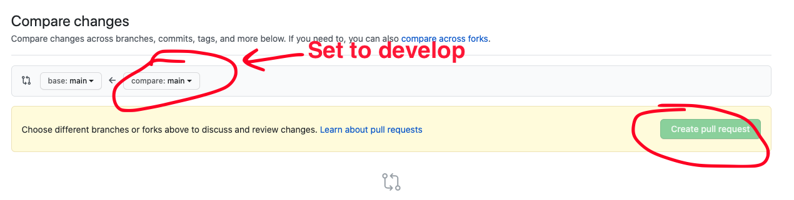

# Portfolio

## Overview

In this project, you will first create a basic portfolio template website that
you will continue to populate and update throughout the year as you work on
projects.

* [Setup your repository](#setup-your-repository)
  * [Sign up for the project](#sign-up-for-project)
  * [Setup Git LFS](#setup-git-lfs)
* [Milestones](#milestones)
  * [Milestone 1](#milestone-1)
  * [Milestone 2](#milestone-2)
  * [Milestone 3](#milestone-3)
* [Grading](#grading)
  * [Computational Thinking](#computational-thinking)
  * [Computing, Programming and Practice](#computing-programming-and-practice)
  * [Skills of a Student](#skills-of-a-student)
* [Getting Help](#getting-help)

## Setup your repository

### Sign up for Project

Sign up for the project repository here:
[https://classroom.github.com/a/a4ro-T-A](https://classroom.github.com/a/a4ro-T-A)

The Web Dev Piaza can be found here: [piazza.com/chadwickschool.org/fall2020/bdf2](piazza.com/chadwickschool.org/fall2020/bdf2)

After your repository has initialized it, clone it to your computer. I recommend
putting it in your `ap-csp` directory.

After you've cloned your repository, run the `setup.sh` script in the root of
that repository to initialize it's configuration.

Upon completion it should display a message similar to this one:

```
######################################################
# SETUP IS COMPLETE. YOU SHOULD NOW CREATE A         #
# `develop` BRANCH BY RUNNING THE FOLLOWING COMMAND: #
#                                                    #
# git checkout -b develop                            #
#                                                    #
# THEN PUSH THAT BRANCH TO GITHUB BY RUNNING THE     #
# FOLLOWING COMMAND:                                 #
#                                                    #
# git push -u origin develop                         #
#                                                    #
# AFTER PUSHING, OPEN A PULL REQUEST FROM YOUR       #
# `develop`  BRANCH TO THE `main` BRANCH BY VISITING #
# THIS REPO ON GITHUB, CLICKING `Pull Requests`      #
# THEN `New pull request`. THE BASE BRANCH SHOULD BE #
# `main` and THE COMPARE BRANCH SHOULD BE `develop`. #
#                                                    #
# FINALLY, ADD YOUR INSTRUCTOR AS A REVIEWER ON      #
# GITHUB. THIS IS HOW YOUR INSTRUCTOR WILL SEE YOUR  #
# WORK.                                              #
######################################################
```

Follow the directions to create a `develop` branch as well as pushing your
`develop` branch to Github.

Finally, create a pull request from your `develop` branch to the `main` branch
and assign `jcollard` as a reviewer.





### Setup Git LFS

For all future projects, we will be using `git-lfs`. On Mac, the easiest way to
install it is running `brew install git-lfs` in your terminal. If you are not on
mac, you will need to install it for your system: https://git-lfs.github.com/

You will know Git LFS is working when you run `git-lfs` in your repository and
get the following message:

```
$ git lfs install
Updated git hooks.
Git LFS initialized.
```

## Milestones

### Milestone 1

Create an outline of your Portfolio HTML Page

Due: Monday October 26th @ 8am

Your final portfolio page will include at least two sections: About Me and
Projects. 

The first Milestone is to create a directory for your portfolio and create a
single `index.html` file within. Then add basic HTML tags to that file to create
an About Me page with the following information:

* About Me
  - Introduce yourself
  - List a few interesting things about yourself: hobbies, skills, games you
    play, any awards you've received, etc
  - List what your goals are in AP Computer Science
* Projects
  - Bash Quest - Create a section describing your Bash Quest project. Include
    your design document and describe your Adventure. Include instructions for
    downloading and running your adventure.

All code that you would like to count toward your evaluation should be part of a
`tag` on in your repository called `milestone-1`. This can be created by running
`git tag milestone-1`. Then push your tag to your repository by running `git
push -u origin milestone-1` The date of this tag creation will be used to
determine when your work was submitted. 

### Milestone 2

Add Styling to your Portfolio using CSS

Due: Thursday October 29th @ 8am

Using CSS, add styling to your Portfolio page to make it your own! In your
portfolio directory, create a file called `styles.css` that contains all of your
styling information. Then, in the `<head>` tag of your `index.html` add the
following code:

```
<link rel="stylesheet" href="styles.css">
```

Your CSS file must contain several styling choices but they can be whatever you
like.

Pro tip: Googling "Portfolio Layouts" can give you a ton of inspiration and code
examples. However, do not copy / paste an entire layout. Only take the CSS
components you need for your portfolio.

All code that you would like to count toward your evaluation should be part of a
`tag` on in your repository called `milestone-2`. This can be created by running
`git tag milestone-2`. Then push your tag to your repository by running `git
push -u origin milestone-2` The date of this tag creation will be used to
determine when your work was submitted. 

### Milestone 3

Completed Portfolio

Due: Monday November 2nd @ 8am

Complete your portfolio by adding at least two more sections and a menu that
allows you to quickly navigate between the sections of your portfolio. This can
all be contained on one page or it can be multiple pages.

All code that you would like to count toward your evaluation should be part of a
`tag` on in your repository called `milestone-3`. This can be created by running
`git tag milestone-3`. Then push your tag to your repository by running `git
push -u origin milestone-3` The date of this tag creation will be used to
determine when your work was submitted. 

## Grading

### Computational Thinking

In this assignment, you will demonstrate your understanding of basic HTML tags and how they interact with CSS to create a rich user experience.

| Advanced                                                    | Proficient                                           | Basic                                                           | Below Basic                                              |
|-------------------------------------------------------------|------------------------------------------------------|-----------------------------------------------------------------|----------------------------------------------------------|
| Adds at least 4 sections or pages to their portfolio        | Adds at least 3 sections or pages to their portfolio | Student creates an About Me and Portfolio Section               | Student creates an About Me section with some text in it |
| Adds a navigation menu to jump to each section or page      | Utilizes CSS to create a unique Portfolio page       | <head> tag includes link to styling and title                   | Little or no CSS Styling                                 |
| Does not have any style attributes in their HTML components | Links to their BashQuest files for downloading       | Specifies DOCTYPE                                               | Doesn't have working <head> tag                          |
| Uses additional tags                                        | Utilizes image tags                                  | Utilizes header tags, paragraph tags, div tags, and anchor tags |                                                          |

### Computing, Programming, and Practice

This section covers how organized and readable your code is as well as your
ability to follow the commit guidelines and templates.

| Advanced                                                                               | Proficient                                                       | Basic                                                           | Below Basic                                                                    |
|----------------------------------------------------------------------------------------|------------------------------------------------------------------|-----------------------------------------------------------------|--------------------------------------------------------------------------------|
| All of the student's HTML and CSS are well indented                                    | The majority of the HTML / CSS is well formatted and indented    |                                                                 | Students code is not well formatted                                            |
| Student provides ample comments in HTML to help keep sections organized and separated. | Student provides few comments in their HTML files                | Student wrote some comments                                     | Student did not write comments                                                 |
| Student provides comments in their CSS describing their styling choices                | Student provides few comments in their CSS Files                 |                                                                 |                                                                                |
| All of the students commits follow the commit message template.                        | Most of the students commits follow the commit message template. | Some of the students commits follow the commit message template | Few or none of the students commit messages follow the commit message template |

### Skills of a Student

Your skills of a student covers your StudentLog repository, your in class time
management, meeting deadlines, asking for help when needed, and helping others
when able.

| Advanced                                                                           | Proficient                   | Basic                                                    | Below Basic                                          |
|------------------------------------------------------------------------------------|------------------------------|----------------------------------------------------------|------------------------------------------------------|
| Manages time well in class, stays focused on work  at hand at all times            | Focuses on work in class     | Focuses at times, can get distracted                     | Uses class time poorly, is frequently distracted     |
| Meets all deadlines, on or ahead of schedule                                       | Meets deadlines              | Delivers close to deadline, may be late  by a day or two | Delivers work late or not at all                     |
| Advocates for self, seeks clarification when needed  and volunteers to help others | Seeks assistance when needed | Needs prompting to seek assistance                       | Does not seek assistance or ask for help when needed |

## Getting Help

All questions should be posted to the class Piazza board. You are also
encouraged to help other students who post on Piazza. When you post your
question, be sure to include as many details as possible for reproducing the
issue you're having.

Questions you should answer when asking a question include:

1. What are you trying to do?
2. What did you try?
3. What was the result?

Work hard to make sure the person trying to answer your question can reproduce
your error. Share your files so others can run exactly what you're running.

Also, include screenshot!

Formulating good questions is a good life long skill. You should try asking your
question on Piazza before seeking out synchronous time with Mx. Collard.
However, if you would like to meet to discuss synchronously, first, look at [Mx.
Collard's Calendar](http://tinyurl.com/mx-collard-calendar), then send them an
email with at least two proposed times you would like to meet.